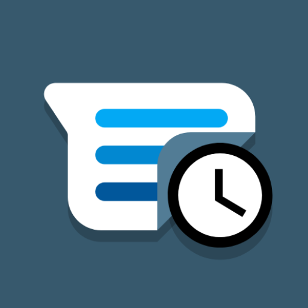

# SMS Scheduler V2 (Soon to be released)

An app made to easily schedule treatments for small companies. You choose a customer and time and the app will automatically send a SMS to the customer. The SMS text is made as an template which you can get variables such as name, time and date of treatment replaced in the SMS text. You can choose when the SMS should be sent relative to the treatment date with a time template.

### Automatic updates from template

If you need to change your SMS text template all scheduled treatments which is not yet sent will be updated and the new text will be sent.

### Variables

Variables are words in the message template which will be replace with data and make you SMS custom for each customer and treatment.

#### Possible variables

variable name | explanation
--|--
[name] | the name of the customer which have booked the treatment
[min] | the minute which the customer should arrive
[hour] | the hour which the customer should arrive. currently only supports 24h format
[day] | the day of the month which the customer should arrive
[month] | the month of the year which the customer should arrive
[year] | the year which the customer should arrive. Currently only a 4 digit number, e.g 2021

### Notifications

If an SMS fails to be sent you will receive a notification. There is also in app notifications which help you solve the problems faster and easier by giving you actions based on the error.

### Scheduling treatment flow preview

